

## **Reproducing the Omniscape.jl example with omniscape SyncroSim**

This tutorial provides an overview of working with **omniscape** SyncroSim in SyncroSim Studio. It covers the following steps:

1. <A href="#step-1">Creating and configuring an omniscape SyncroSim Library</A>
2. <A href="#step-2">Visualizing scenario results</A>
3. <A href="#step-3">Creating, editing, and running a new scenario</A>
4. <A href="#step-4">Comparing results across scenarios</A>
5. <A href="#step-5">Understanding ensemble connectivity</A>

 

### **Requirements**

This tutorial requires **omniscape** SyncroSim package version 2.8.0 or greater, SyncroSim version 3.1.0 or greater, and Julia version 1.9 or greater. For more information, see <A href="https://apexrms.github.io/omniscape/getting_started">Getting started</A>.

 

 <h3><b>Step 1. Creating and configuring an omniscape SyncroSim Library</b></h3> 

In SyncroSim, a library is a file with extension .ssim that stores all the model’s inputs and outputs in a format specific to a given package. To create a new library:

1\.	Open SyncroSim Studio.

2\.	Select **File > New > From Online Template..**.

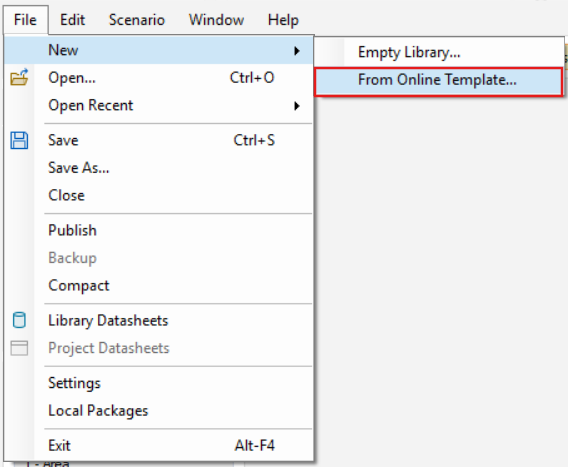

a. From the list of packages, select <b>omniscape</b>.
  
b. Select the <b>Omniscape Example</b> template library. If desired, you may edit the <i>File name</i>, and change the <i>Folder</i> by clicking on the <i>Browse</i> button. Click <b>OK</b>.

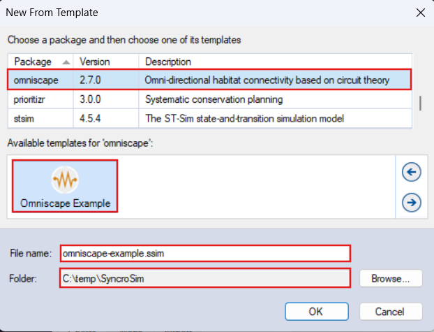

 

A new library has been created based on the selected template. SyncroSim will automatically open and display it in the Library Explorer window.

3\.	Double-click on the library name, **Omniscape Example**, to open the library properties window. You may also right-click on the library name and select **Open** from the context menu.

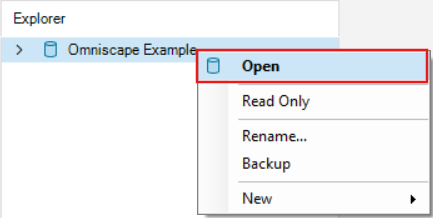

4\.	The **General** tab should open automatically. In this tab, the *Summary* datasheet contains the metadata for the library.

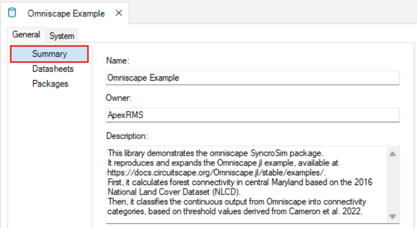

5\.	Next, navigate to **System** tab and open the **Tools > Julia** datasheet.

 
The path to the <b>Julia executable</b> file must be specified to run <b>omniscape</b> SyncroSim. To do so, click on the <b>Browse</b> button and navigate to where Julia is installed in your computer. Its default location is <b>C:\Users\[User_Name]\AppData\Local\Programs\Julia-[version]\bin\julia.exe</b>. 

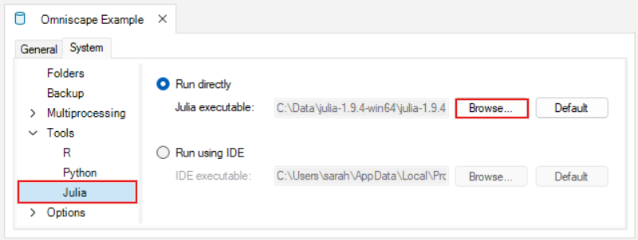

> **Note:** The path to the Julia executable may not contain spaces. The AppData folder is sometimes hidden. To see it, in File Explorer, select View > Show > Hidden items.

> **Note:** The first time a scenario is run, **omniscape** SyncroSim installs the Omniscape.jl and GDAL Julia packages automatically, so the first run takes longer than subsequent runs.

6\.	Next, navigate to the datasheet under **Options > General**, and mark the checkbox for **Use conda**.

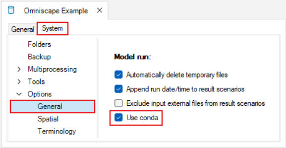

7\.	Close the library properties window.

 

Next, you will review the inputs of the *Reference resistance* scenario. In SyncroSim, each scenario contains the model inputs and outputs associated with a model run.

1\.	In the Library Explorer window, select the pre-configured scenario **Reference resistance** and double-click it to open its properties. You may also right-click on the scenario name and select **Open** from the context menu.

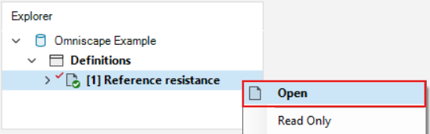

2\.	Under the **General** tab, navigate to the **Pipeline** datasheet.

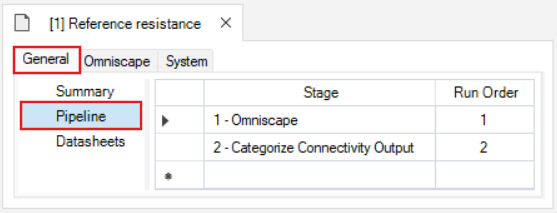

a. Under the <i>Stage</i> column, note that two pipeline stages are set in the following order:
 

    i.	<i>1 - Omniscape</i> – runs Omniscape.jl 
      
    ii.	<i>2 - Categorize Connectivity Output</i> – classifies the continuous output from Omniscape.jl into connectivity categories based on a set of threshold values
     
  

  Each pipeline stage calls on a transformer (<i>i.e.</i>, script) which takes the inputs from SyncroSim, runs a model, and returns the results to SyncroSim.
    
  Two further pipeline stages are available but not used in this scenario: <i>0 - Prepare Spatial Tiling</i>, which splits large landscapes into tiles that can be processed in parallel (see <A href="#step-3">Step 3</A>), and <i>1.5 - Ensemble Connectivity</i>, which combines the outputs of several scenarios (see <A href="#step-5">Step 5</A>).

 

The *1 - Omniscape* pipeline stage replicates the exact structure and order of parameters as Omniscape.jl with inputs organized under two nodes: *Required* and *Optional*. 

3\.	Navigate to the **Omniscape** tab and select the **Required** datasheet, which contains the following inputs:

  a. <i>Resistance file</i> – a raster file of land cover or resistance classes. For this example, the pre-loaded raster corresponds to the 2016 National Land Cover Dataset for central Maryland.
    
  b. <i>Radius</i> – sets the radius of the moving window. This example uses a radius of 100 pixels.
    
  c. <i>Source file</i> – a raster file indicating which pixels correspond to sources. In this example, the sources are set through a different method, described in the next step.

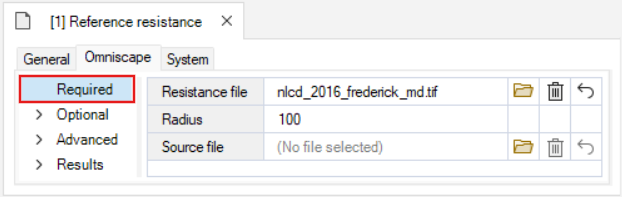

4\.	Navigate to the **Optional** node.

  a.	Under the <i>General Options</i> datasheet, note that <i>Source from resistance</i> is set to <i>Yes</i>, enforcing that the sources be calculated from the resistance layer based on a threshold of 1 as defined by <i>R cutoff</i>. Also note that <i>Calculate normalized current</i> and <i>Calculate flow potential</i> are both set to <i>Yes</i>.

  
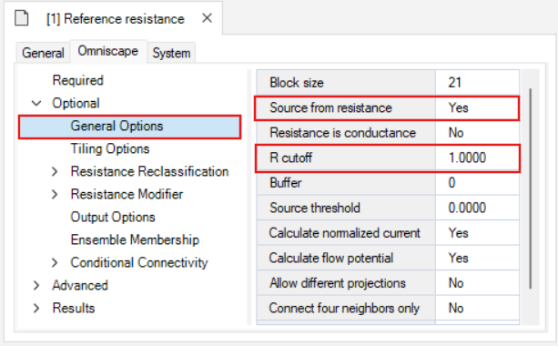

> **Note:** *Calculate normalized current* and *Calculate flow potential* default to *No*. The *Normalized current flow* map is only produced when *Calculate normalized current* is set to *Yes*, and both the *2 - Categorize Connectivity Output* and *1.5 - Ensemble Connectivity* stages require it. If you create a scenario from scratch rather than copying one from the template library, remember to set both to *Yes*.

  The remaining <i>General Options</i> mirror those of Omniscape.jl and are left at their defaults in this example:
   
  

    i. <i>Block size</i> – the width, in pixels, of the square blocks whose centres are used as moving window targets. A block size greater than 1 speeds up the run by solving one moving window per block rather than per pixel, at the cost of some precision. It must be an odd number. When the <i>0 - Prepare Spatial Tiling</i> stage is used, the block size also sets the minimum tile size.
      
    ii. <i>Resistance is conductance</i> – set to <i>Yes</i> if the <i>Resistance file</i> (or the <i>Reclass Table</i>) holds conductance rather than resistance values.
      
    iii. <i>R cutoff</i> – the maximum resistance value a pixel may have to be treated as a source when <i>Source from resistance</i> is <i>Yes</i>.
      
    iv. <i>Buffer</i> – a distance, in pixels, added to the radius. Sources beyond the radius but within the buffer still inject current into the moving window, which reduces edge effects.
      
    v. <i>Source threshold</i> – only pixels with a source strength greater than this value are included as sources.
      
    vi. <i>Allow different projections</i> – suppresses the Omniscape.jl warning raised when input rasters have different projections. Note that <b>omniscape</b> SyncroSim still requires the <i>Resistance file</i> and <i>Source file</i> to have the same coordinate reference system and extent, and resistance modifier rasters to have the same coordinate reference system and resolution.
      
    vii. <i>Connect four neighbors only</i> – set to <i>Yes</i> to connect each pixel only to its four cardinal neighbours, rather than all eight neighbours.
      
    viii. <i>Solver</i> – the linear solver used by Omniscape.jl: <i>cg+amg</i> (the default) or <i>cholmod</i>.
  

> **Note:** Unless *Resistance Reclassification* is used, the *Resistance file* may not contain values of 0 or less, and the run stops with an error if it does.

  b. Navigate to the <b>Resistance Reclassification</b> node and review the following inputs:
   
  

    i.	<i>Options > Reclassify resistance</i> – determines whether the <i>Resistance file</i> should be reclassified. For this example, it is set to <i>Yes</i> since the <i>Resistance file</i> provided in step 3.a corresponds to a raster of land cover classes.
      
    ii.	<i>Options > Write reclassified resistance</i> – determines whether the reclassified resistance raster should be saved and written to file. 
    

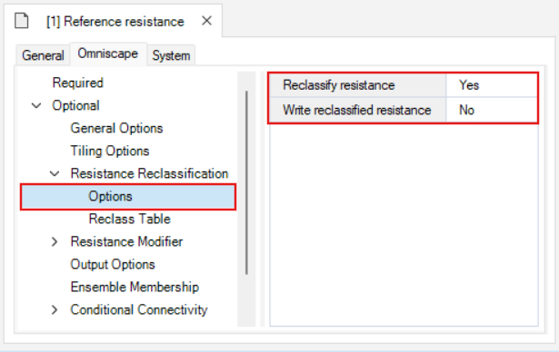

  iii.	<i>Reclass Table</i> – a reclassification matrix used to translate land cover classes into resistance values.
  

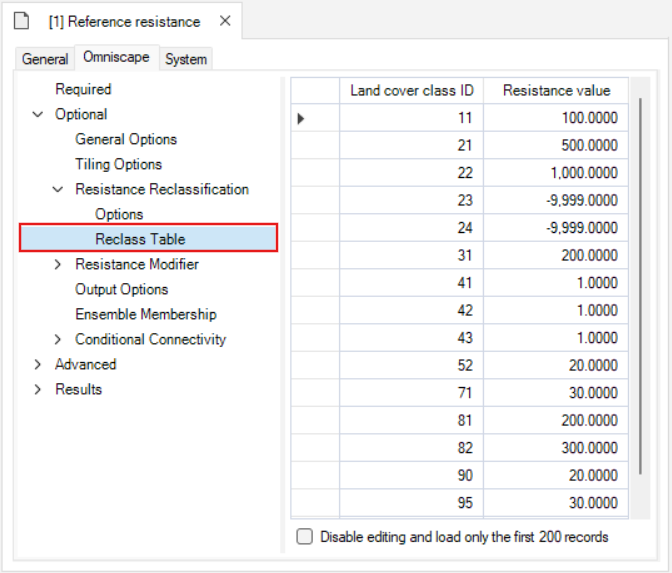

  c. Navigate to the <b>Resistance Modifier</b> node. This is optional, and is left empty in this example, but it is worth knowing what it does.
   
  

    i. <i>Options</i> – Rescaling determines how the modified surface is brought back to the largest resistance value in the Reclass Table, and has four options: Exact (no rescaling, so the surface may exceed that value), Proportional (the whole surface is divided by the largest multiplier, preserving every ratio between pixels), Cap (modified values are clamped at the maximum, leaving pixels no modifier touched unchanged), and Min-Max (the surface is stretched onto the Reclass Table's full range, which does not preserve ratios between pixels). Write modified resistance determines whether the final modified resistance raster should be saved and written to file.
      
    ii. <i>Resistance Modifiers</i> – one row per secondary raster whose values should scale resistance: slope, road density, or any other continuous surface. Each row may optionally aggregate that raster through a focal window first, using <i>Use focal window</i>, <i>Focal radius (pixels)</i> and <i>Focal function</i> (Mean, Sum, Max or Min).
      
    iii. <i>Modifier Lookup Table</i> – maps ranges of a modifier raster's values to multipliers. Ranges are half-open (<i>Min modifier value</i> ≤ value &lt; <i>Max modifier value</i>) and may not overlap. Gaps are allowed and mean "leave this range alone": a pixel matching no range keeps a multiplier of 1.0.
    

> **Note:** Resistance modifiers are applied after the *Reclass Table*, so they scale resistance values rather than land cover class IDs. For example, a multiplier of 3 applied to a class with a reclass value of 10 gives a resistance of 30. Because modifiers multiply, they can also push resistance beyond the largest value in the *Reclass Table* (a maximum of 32 with a ×2 modifier gives 64). Use *Options > Rescaling* to control this.

> **Note:** Every land cover class present in the *Resistance file* must have a row in the *Reclass Table*, otherwise the run stops with an error. To exclude a class from the analysis, map it to -9999 (NoData). Resistance values must otherwise be greater than 0.

> **Note:** If *General Options > Resistance is conductance* is set to *Yes*, the *Reclass Table* yields conductance values. The multipliers are then inverted internally, so a *Resistance multiplier* of 2 still doubles resistance. The run log records when this happens.

 

  d. The remaining datasheets under the <b>Optional</b> node are also left at their defaults in this example:
   
  

    i. <i>Tiling Options</i> – controls how the landscape is split into tiles when the <i>0 - Prepare Spatial Tiling</i> stage is used: <i>Parallelization Intensity</i> (Auto, Conservative, Balanced or Aggressive), <i>Buffer Multiplier</i> (tile overlap as a multiple of the radius), and <i>RAM per Thread (GB)</i>. For more information, see the <A href="https://apexrms.github.io/omniscape/prepMultiprocessingTransformer">spatial tiling documentation</A>.
      
    ii. <i>Output Options</i>
    

      • <i>Write raw cumulative current map</i> – whether the <i>Cumulative current flow</i> map is saved. Defaults to <i>Yes</i>.
       
      • <i>Mask nodata</i> – whether pixels that are NoData in the <i>Resistance file</i> are also set to NoData in the outputs. Defaults to <i>Yes</i>.
       
      • <i>Write as tif</i> – whether outputs are written as GeoTIFF (.tif) files rather than ASCII grids. <b>omniscape</b> SyncroSim only reads back .tif outputs, so leave this empty or set it to <i>Yes</i>; if it is set to <i>No</i>, the outputs will not appear in the results.
    

      
    iii. <i>Ensemble Membership</i> – declares which ensemble member (typically a species) the scenario represents. This is used by the <i>1.5 - Ensemble Connectivity</i> stage and is covered in <A href="#step-5">Step 5</A>.
      
    iv. <i>Conditional Connectivity</i> – replicates the climate and conditional connectivity options of Omniscape.jl, which restrict current flow to pairs of source and target pixels with similar conditions (for example, climate). For more information, see the <A href="https://docs.circuitscape.org/Omniscape.jl/latest/usage/#Conditional-connectivity-options">Omniscape.jl documentation</A>.
    

      • <i>Options</i> – <i>Conditional</i> turns conditional connectivity on, and <i>Number of conditions</i> sets whether one or two conditions are used.
       
      • <i>Condition 1</i> and <i>Condition 2</i> – for each condition, a raster of the condition (<i>Condition file</i>) and how target pixels are compared with source pixels (<i>Comparison</i>). When <i>Comparison</i> is <i>within</i>, a target pixel is only connected to a source pixel if the difference between their condition values falls between the <i>lower</i> and <i>upper</i> bounds, which are then required.
       
      • <i>Future Conditions</i> – <i>Compare to future</i> sets which condition(s), if any, compare present conditions at source pixels with future conditions at target pixels: <i>none</i>, <i>1</i>, <i>2</i> or <i>both</i>. The matching <i>Condition future file</i> is required for each condition compared.
    

  

 

The *2 - Categorize Connectivity Output* pipeline stage is an exclusive feature of the **omniscape** SyncroSim package. It allows for seamless post-processing of the continuous output of Omniscape into discrete connectivity categories based on user-defined connectivity categories, a common step in the Omniscape workflow.

5\.	In the Library Explorer, double-click on **Definitions** to open the project properties. You may also right-click on the project name and select **Open** from the context menu. 

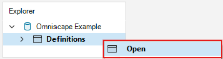

6\.	Under the *Summary* datasheet, the *Description* field highlights that the connectivity categories and thresholds used in the template library were derived from Cameron *et al.* (2022, Conservation Science and Practice).

7\.	Navigate to the **Connectivity Categories** datasheet.

  a.	Note that four connectivity categories have been defined, each associated with an ID value.
    
  b.	Click on the <b>Category ID</b> column to sort categories in ascending order, where <i>Impeded</i> represents areas with the least amount of flow, and <i>Channelized</i> represents areas with the greatest amount of flow.

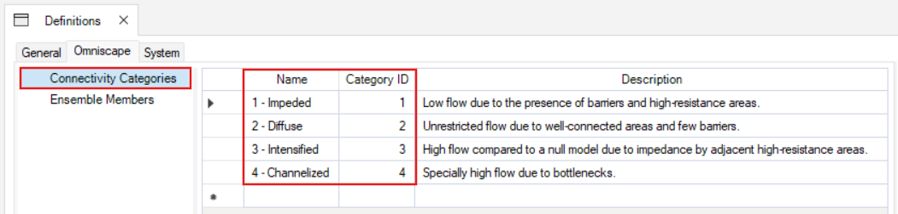

8\.	Return to the scenario properties window and navigate to the **Advanced** node.

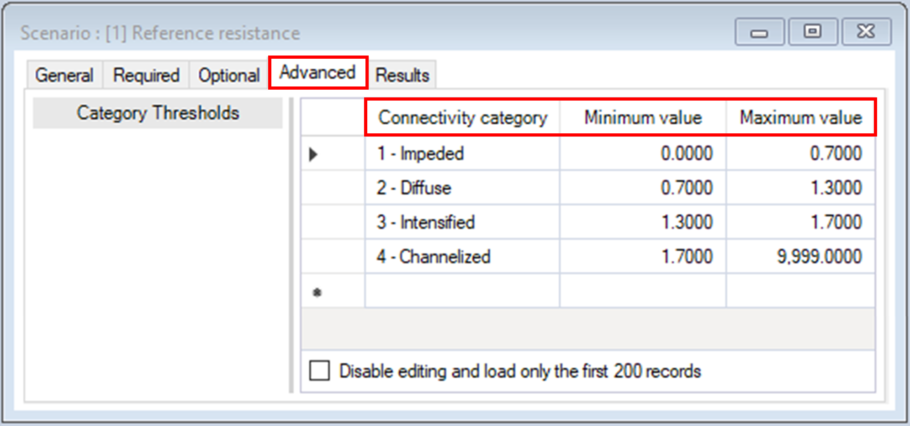

  a. Under <i>Options</i>, note that <i>Threshold type</i> is set to <i>Value</i>. The threshold values are then compared directly against the normalized current flow. Alternatively, <i>Quantile</i> treats each threshold as a proportion (0–1) of the distribution of values, with the break values computed from each run. This is useful when the range of the surface is not known ahead of time, as is the case for an ensemble (see <A href="#step-5">Step 5</A>).
    
  b. Under <i>Category Thresholds</i>, note that each connectivity category is associated with a minimum and maximum value, defining the range of normalized current flow that will be reclassified into each connectivity category.

9\.	Close the scenario properties window.

 

 <h3><b>Step 2. Visualizing scenario results</b></h3> 

The Omniscape Example template library already contains the results for the *Reference resistance* scenario. In SyncroSim, the results for a scenario are organized into a *Results* folder, nested within its parent scenario. 

1\.	In the Library Explorer window, click on the arrow beside the *Reference resistance* scenario to expose the *Results* folder; repeat the same action to expose the results scenario. 

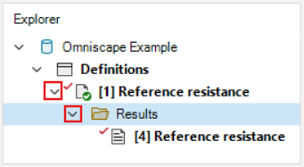

2\.	Double-click on the results scenario to open its properties.

a. Click through the <b>Required</b>, <b>Optional</b> and <b>Advanced</b> nodes and note that the results scenario is a copy of the parent scenario’s inputs, which are greyed out.

 
  
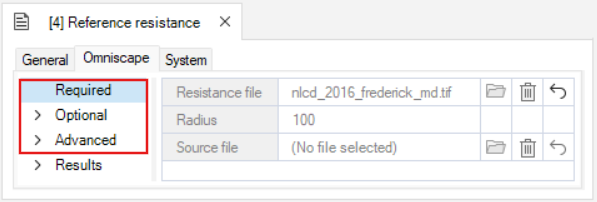

b. Navigate to the <b>Results</b> node, which lists the spatial and tabular outputs. Both pipeline stages have spatial outputs but only the second pipeline stage has tabular outputs.
 

i. Under the <b>Spatial</b> node, the outputs from the first and second transformers are organized under the <i>Omniscape Outputs</i> and <i>Connectivity Categories</i> datasheets, respectively.
  
Besides the three current flow maps, <i>Omniscape Outputs</i> holds two resistance surfaces:

• <i>Classified resistance</i> – the resistance surface after reclassification by the <i>Reclass Table</i>, when <i>Write reclassified resistance</i> is <i>Yes</i>. If the resistance is not reclassified, it points to the original <i>Resistance file</i>. It is not written when the scenario is split into tiles.
 
• <i>Modified resistance</i> – the final resistance surface after all resistance modifiers and rescaling are applied, when <i>Write modified resistance</i> is <i>Yes</i>. It is empty when no resistance modifiers are used.

 
Between them sits the <i>Ensemble</i> datasheet, which holds the output of the <i>1.5 - Ensemble Connectivity</i> stage: a single <i>Ensemble connectivity</i> raster that combines the <i>Normalized current flow</i> of two or more scenarios. Because that stage is not part of this scenario's pipeline, the <i>Ensemble</i> datasheet is empty here. When an ensemble is run, <i>2 - Categorize Connectivity Output</i> classifies the <i>Ensemble connectivity</i> raster instead of the <i>Normalized current flow</i> (see <A href="#step-5">Step 5</A>).
  
You can export any spatial output by clicking on the <i>Export</i> button.

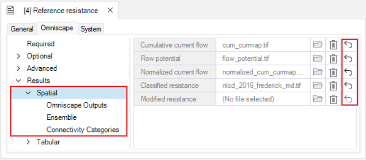

ii.	Under the <b>Tabular</b> node, the output of the second transformer is saved to the <i>Connectivity Categories Summary</i> datasheet. For each connectivity category, it records the <i>Minimum value</i> and <i>Maximum value</i> actually used to classify it, its <i>Area</i> (ha), and its <i>Proportion of area</i> (between 0 and 1).
  
You can export the tabular output by right-clicking on the data and selecting <i>Export All</i> from the context menu.

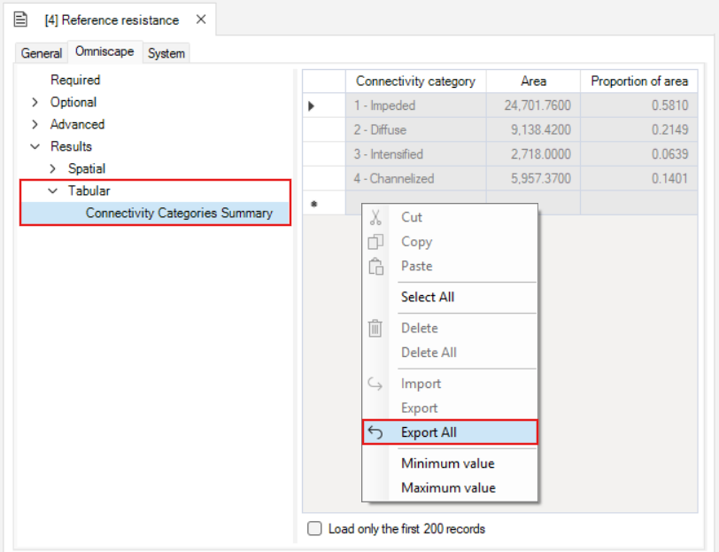

3\.	Close the results scenario properties.

Using the SyncroSim built-in tools, you will now visualize the outputs of the first transformer.

4\.	In the Library Explorer window, right-click on the **Reference resistance** scenario and select **Add to Results** from the context menu. 

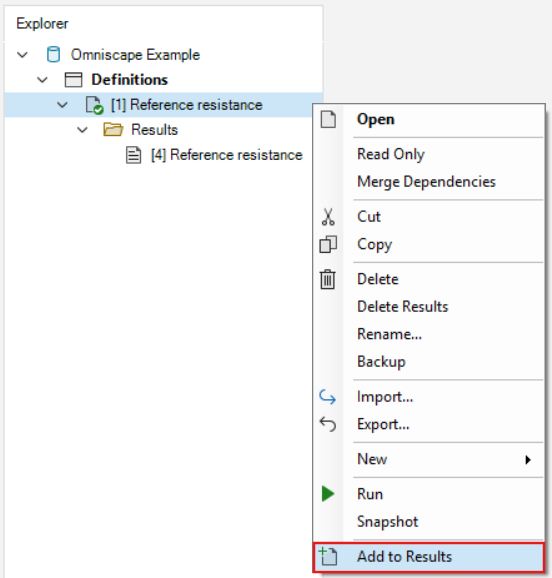

5\.	Navigate to the **Maps** tab and double-click on the first pre-configured map, **Cumulative current flow**. 

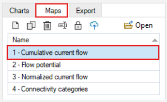

The cumulative current flow represents the total current flowing through the landscape. To inspect the map, consider the following:

  a.	<i>Map legend</i> – displayed along the left-hand side of the window. It can be edited by double-clicking it.
    
  b.	<i>Toolbar</i> – displayed along the top of the window. Includes zoom, pan and per pixel information tooltip.

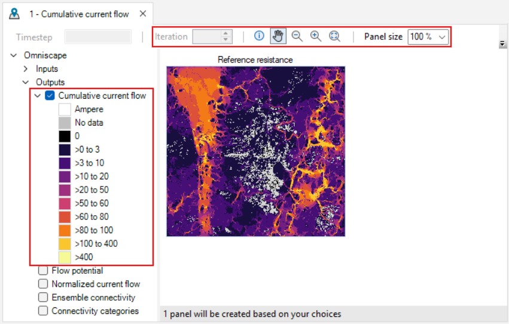

6\.	Close the map window and view the two following maps.

  a.	<b>Flow potential</b> represents current flow under the null condition of resistance set to 1 for the entire landscape. 

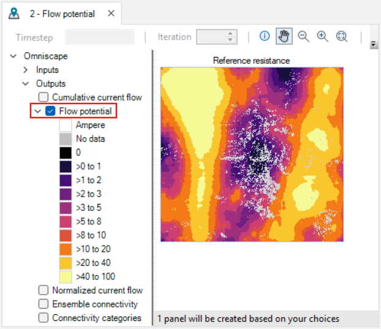

  b.	<b>Normalized current flow</b> is calculated as cumulative current divided by flow potential, and therefore represents where there is more or less current than expected under null resistance conditions.

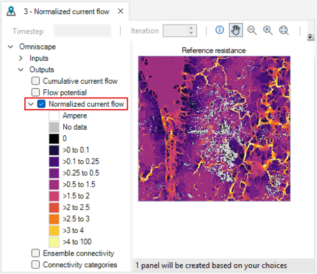

The <b>Maps</b> tab also includes an <i>Inputs</i> group, with maps of the <i>Sources</i>, the <i>Resistance</i> surface (the <i>Classified resistance</i> output described above) and the <i>Modified resistance</i> surface. In this example, the sources are calculated from the resistance layer and no resistance modifiers are used, so only the <i>Resistance</i> map is populated.

 

Next, you will visualize the outputs of the second transformer, which takes the *Normalized current flow* map and reclassifies it into a discrete map, based on the threshold values reviewed in Step 1.

7\.	View the **Connectivity categories** map.

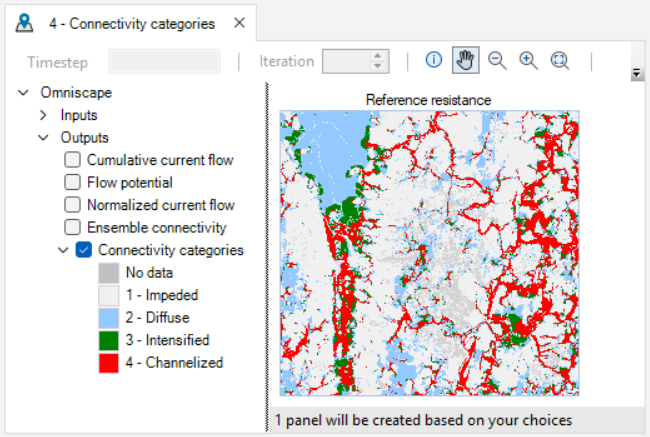

8\.	Keep the map open for comparison and from the Library Explorer window, navigate to the **Charts** tab and view the **Area (ha)** chart. 

Note that it summarizes the amount of area per connectivity category.
Alternatively, a <b>Proportion of area</b> summary is also available.

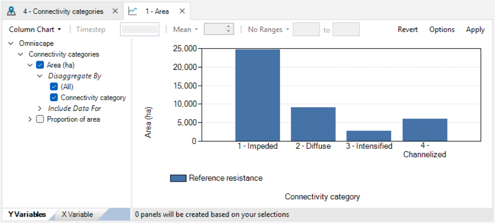

9\.	Close all plot windows.

 

 <h3><b>Step 3. Creating, editing, and running a new scenario</b></h3> 

Next, you will learn how to create a scenario and run it to generate results. This scenario will differ from the *Reference resistance* by a ten-fold increase in resistance for all non-forest (i.e., non-source) pixels. 

1\.	Right-click on the existing scenario and select **Copy** from the context menu. 

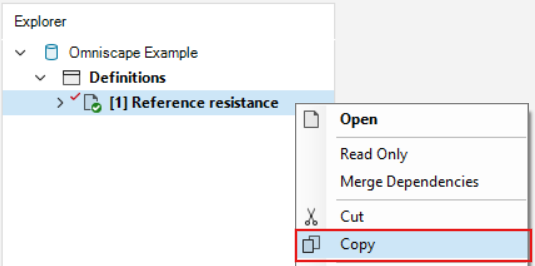

Then, right-click anywhere inside the Library Explorer window and select <b>Paste</b>

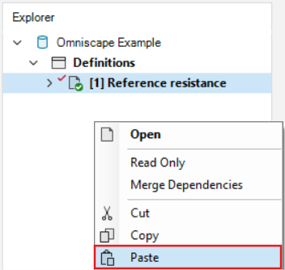

2\.	Double-click on the new scenario to open its properties.

  a.	Change the <b>Name</b> to <i>Increased resistance</i>. 
    
  b.	Change the <b>Description</b> to <i>Resistance values for non-forest land cover types were increased by one order of magnitude. All other configuration options for Omniscape are equal to those implemented in the Omniscape.jl example</i>.

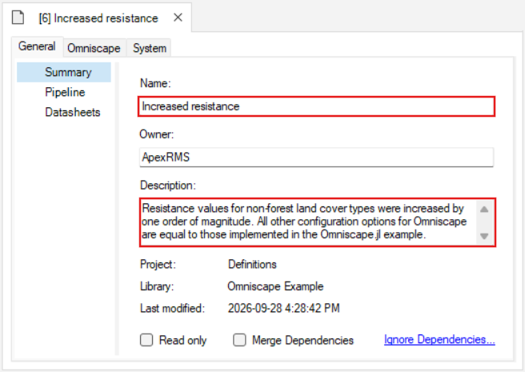

3\.	Navigate to the **Optional** node and under the **Resistance Reclassification** node, open the **Reclass Table** datasheet.

  a.	Under the <b>Resistance value</b> column, increase values by one order of magnitude, except for <i>Land cover class</i> 41, 42, and 43, which represent forest classes.

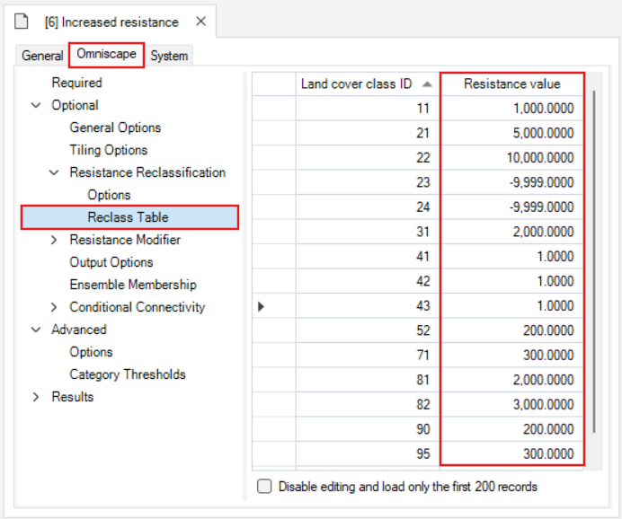

 

Next, you will enable multiprocessing for the scenario. For this example, the run should take approximately 10 minutes with multiprocessing enabled across 5 cores.

4\.	Multiprocessing is set for the whole library, and can be enabled in either of two ways:

  a. <i>From the toolbar</i> – click the <b>Multiprocessing</b> button on the toolbar at the top of the window so that it is highlighted, then set the number of jobs to 5 in the drop-down box beside it.

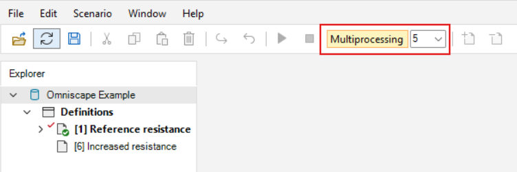
    
  b. <i>From the library properties</i> – double-click on the library name, <b>Omniscape Example</b>, in the Library Explorer to open the library properties window. Navigate to the <b>System</b> tab and select <b>Multiprocessing > General</b>. Mark the checkbox for <b>Enable multiprocessing</b> and set <b>Maximum number of jobs</b> to 5. Leave <i>Run multiple scenarios in parallel</i> and <i>Copy scenario inputs for each job</i> unchecked.
    
  The two are linked, so a change made in one is reflected in the other.

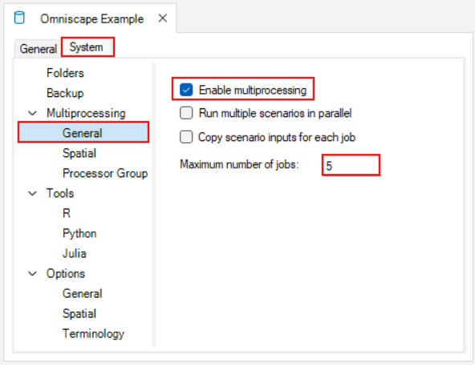

When the scenario is not split into tiles, <i>Maximum number of jobs</i> sets the number of Julia threads used by Omniscape.jl (up to a maximum of 8). The number of threads is further reduced if it would exceed the available memory, estimated using <i>RAM per Thread (GB)</i> in the <i>Tiling Options</i> datasheet (16 GB by default). The <b>Run Log</b> records the number of threads used and whether it was reduced.
  
For large landscapes, you can instead add the <i>0 - Prepare Spatial Tiling</i> stage to the <b>Pipeline</b>, before <i>1 - Omniscape</i>. The landscape is then split into tiles which are run as separate jobs in parallel, and merged back together once complete. The number and size of tiles are controlled by the <i>Tiling Options</i> datasheet under the <b>Optional</b> node. Spatial tiling is generally only beneficial for rasters larger than around 3000×3000 pixels, so it is not used in this example. For more information, see the <A href="https://apexrms.github.io/omniscape/prepMultiprocessingTransformer">spatial tiling documentation</A>.

5\.	Close the scenario and library properties windows and save the changes to the library.

6\.	In the Library Explorer window, right-click on the **Increased resistance** scenario and select **Run** from the context menu.

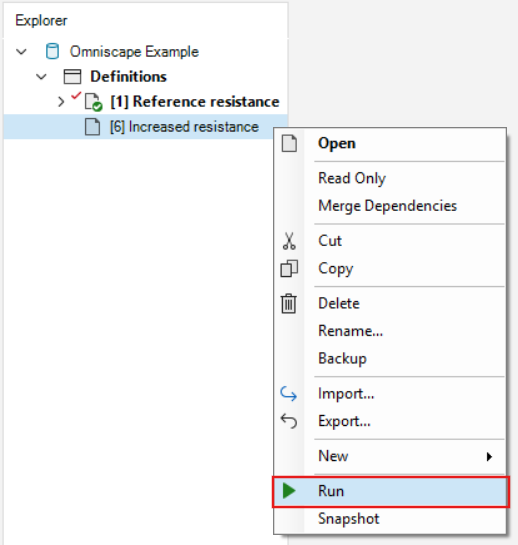

  a.	The <i>Run Monitor</i> window will open, informing that the model is <i>Running</i>.

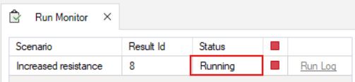

  b.	Along the bottom-right of the window, a progress bar will provide further details.
    
  c.	First, SyncroSim calls the first transformer, <i>1 - Omniscape</i>. 

    i.	<i>Setting up Scenario</i> and <i>Preparing for Omniscape run</i> – the transformer takes the inputs, reclassifies and modifies the resistance surface, and pre-processes the inputs into the format required by Julia. 
      
    ii.	<i>Running Omniscape</i> – the transformer calls Julia to run the analysis. Once the analysis is complete, the transformer retrieves and saves the outputs back to SyncroSim. 
    

  d.	Then, SyncroSim calls the second transformer, <i>2 - Categorize Connectivity Output</i>. 
  

    i.	<i>Setting up Scenario</i> – the transformer takes an output from the first transformer along with the connectivity categories and their threshold values.
      
    ii.	<i>Categorizing connectivity output</i> – the transformer reclassifies the continuous output and returns it back to SyncroSim.
    

7\.	When the run is complete, the *Status* will be updated to *Done*. You can inspect the **Run Log**, which returns the total run time for the scenario, along with details of how the run was configured. 

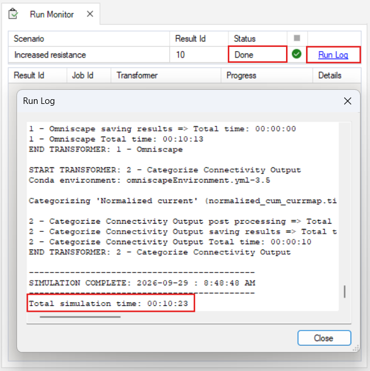

 

 <h3><b>Step 4. Comparing results across scenarios</b></h3> 

With two successful scenario runs, you will now compare their results.

1\.	Ensure that both scenarios are added to the results. This is noted by a red check mark beside the scenario symbol and a bolded scenario name. 

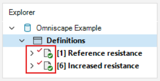

If required, right-click on the scenario(s) and select <b>Add to Results</b> from the context menu.

2\.	First, view the **Area (ha)** chart.

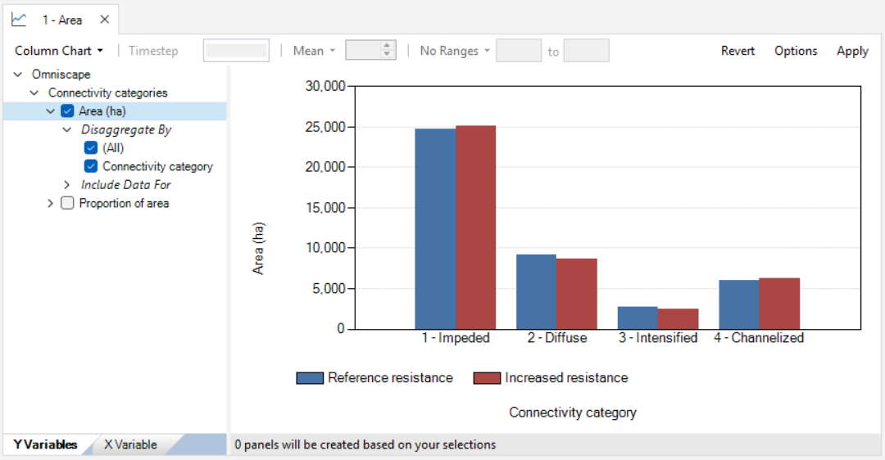

Note that the increase in resistance resulted in a small increase in the amount of <i>Impeded</i> and <i>Channelized</i> areas, and a decrease in the amount of <i>Diffuse</i> and <i>Intensified</i> areas.  

3\.	Next, view the **Connectivity categories** map. 

Zoom in and pan through the map and try to identify where across the landscape those changes in connectivity occurred.

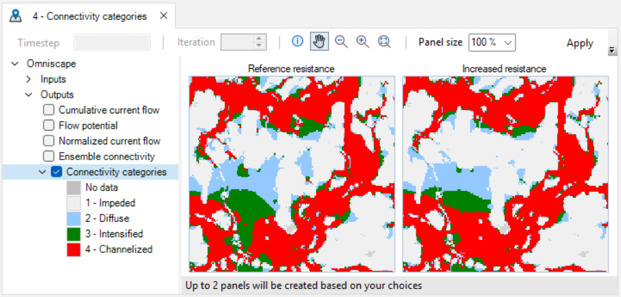

Visually identifying areas of change between scenarios may not be straightforward. For more quantitative tools to compare changes in connectivity, see the next tutorial <A href="omniscapeImpact">Measuring the impact of connectivity change with <b>omniscapeImpact</b></A>.

 

 <h3><b>Step 5. Understanding ensemble connectivity</b></h3> 

Connectivity is often modelled separately for several species, each with its own resistance surface, and then combined into a single multi-species map. The *1.5 - Ensemble Connectivity* pipeline stage combines the *Normalized current flow* outputs of two or more **omniscape** scenarios into one ensemble surface, which can then be classified into connectivity categories. This step explains how an ensemble is configured and how it is calculated.

 

<h4><b>Ensemble members and weights</b></h4>

Each scenario that goes into an ensemble represents an <i>ensemble member</i>, typically a species. Members are used to weight scenarios, and are set up in three places:

  a. <i>Ensemble Members</i> – a project-level datasheet, under <b>Definitions</b>, listing the members available to all scenarios in the project (for example, <i>Generalist</i> and <i>Specialist</i>).
    
  b. <i>Ensemble Membership</i> – under the <b>Optional</b> node of each <b>omniscape</b> scenario, declaring which member that scenario represents. Membership is read from the scenario itself rather than from its results, so it can be set or changed without re-running the scenario.
    
  c. <i>Ensemble Weights</i> – under the <b>Ensemble Connectivity</b> node of the ensemble scenario, giving the relative weight of each member. A weight greater than 1 increases a member's influence and a weight less than 1 decreases it.

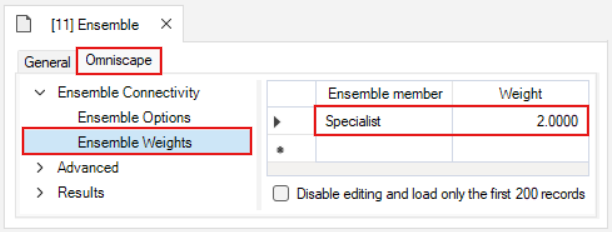

Weighting by member rather than by scenario means the same scenario can carry different weights in different ensembles. Any member without a row in *Ensemble Weights*, and any scenario that does not declare a member, is weighted 1, so an ensemble with no weights is an unweighted one. Each member may be represented by only one scenario in an ensemble, and every weight must match a member represented by one of the scenarios being combined, otherwise the run stops with an error.

 

<h4><b>Setting up an ensemble scenario</b></h4>

An ensemble is run from its own scenario, whose **Pipeline** contains *1.5 - Ensemble Connectivity* in place of *1 - Omniscape*, usually followed by *2 - Categorize Connectivity Output*.

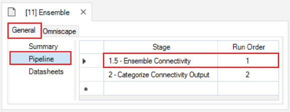

The scenarios to combine are supplied as <i>dependencies</i> of the ensemble scenario, added by dragging each scenario onto the ensemble scenario in the Library Explorer. At least two dependencies are required. Adding a scenario (rather than one of its results) as a dependency automatically uses that scenario's most recent results, and each dependency must have a <i>Normalized current flow</i> output. All dependencies must have the same extent, resolution and projection.

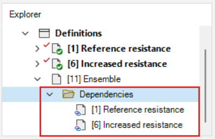

 

<h4><b>How the ensemble is calculated</b></h4>

When the ensemble scenario is run, *1.5 - Ensemble Connectivity* reports *Loading dependency Scenarios* and then *Combining Scenarios into ensemble*, and applies the <i>Ensemble Options</i> in the following order:

  1. <i>Standardize inputs</i> – if set to <i>Yes</i> (the default), each scenario's <i>Normalized current flow</i> is rescaled to 0–1 over its valid (non-NoData) extent, so that scenarios with different ranges of values are comparable.
    
  2. <i>Combination function</i> – the scenarios are combined pixel by pixel using one of:
  

    • <i>Weighted Mean</i> (the default) – the weighted average of the scenarios.
     
    • <i>Weighted Sum</i> – the weighted mean multiplied by the sum of all weights.
     
    • <i>Maximum</i> or <i>Minimum</i> – the highest or lowest value of any scenario at each pixel, representing the best or worst connectivity for any member. These ignore the weights.
  

  A pixel is included in the ensemble if at least one scenario has data there. Where some scenarios are NoData, the statistic is calculated from the scenarios that do have data, so a pixel covered by fewer scenarios is not pulled down by the missing ones.
    
  3. <i>Use focal window</i>, <i>Focal radius (pixels)</i> and <i>Focal function</i> – optionally smooth the combined surface with a square moving window, using the mean, sum, maximum or minimum of the pixels in the window. <i>Focal radius</i> is required when <i>Use focal window</i> is <i>Yes</i>.

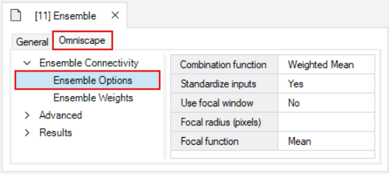

The result is saved as the *Ensemble connectivity* raster, in the *Ensemble* datasheet under **Results > Spatial**, and can be viewed from the **Maps** tab. The **Run Log** records the combination options and the weight used for each scenario.

 

<h4><b>Classifying the ensemble</b></h4>

When *2 - Categorize Connectivity Output* follows *1.5 - Ensemble Connectivity* in the pipeline, it classifies the *Ensemble connectivity* raster instead of a *Normalized current flow*, using the project's *Connectivity Categories* and the scenario's *Category Thresholds* under the <b>Advanced</b> node.

Because an ensemble of standardized surfaces is on a different scale from normalized current flow, thresholds chosen for normalized current flow will usually not suit it. Instead, set <i>Threshold type</i> to <i>Quantile</i> and give each category's minimum and maximum as proportions of the distribution of values, for example: <i>Impeded</i> 0 – 0.2, <i>Diffuse</i> 0.2 – 0.7, <i>Intensified</i> 0.7 – 0.9, and <i>Channelized</i> 0.9 – 1. The break values are then computed from each run and recorded in the <i>Minimum value</i> and <i>Maximum value</i> columns of the <i>Connectivity Categories Summary</i> datasheet, under the <b>Results > Tabular</b> node.

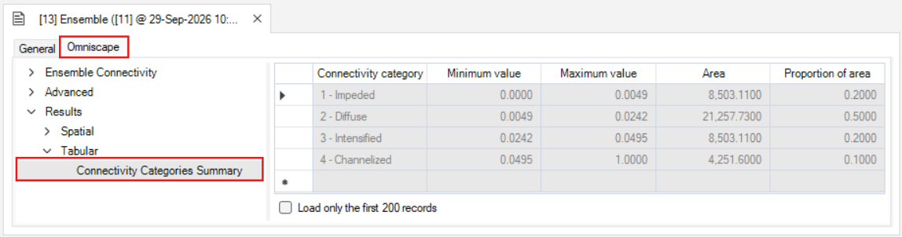

   
